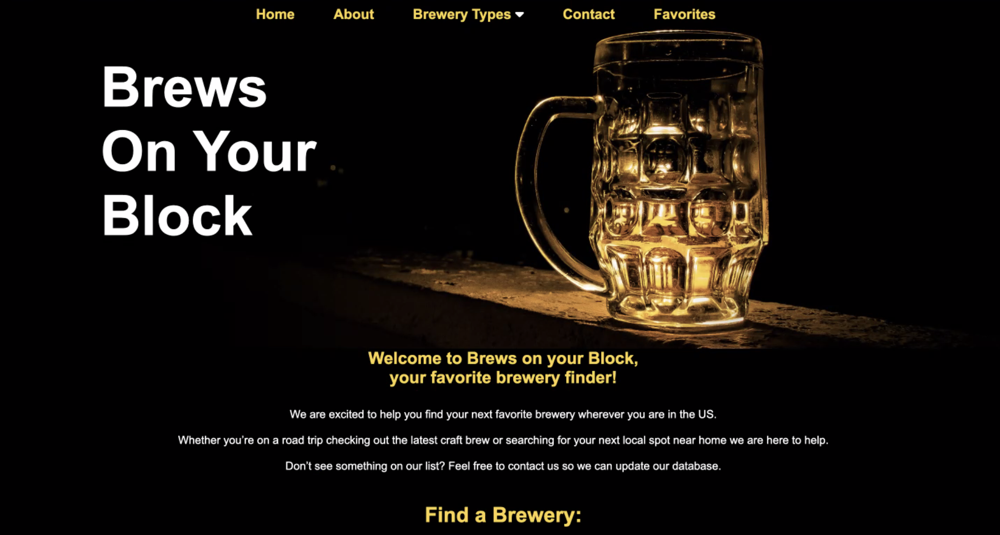
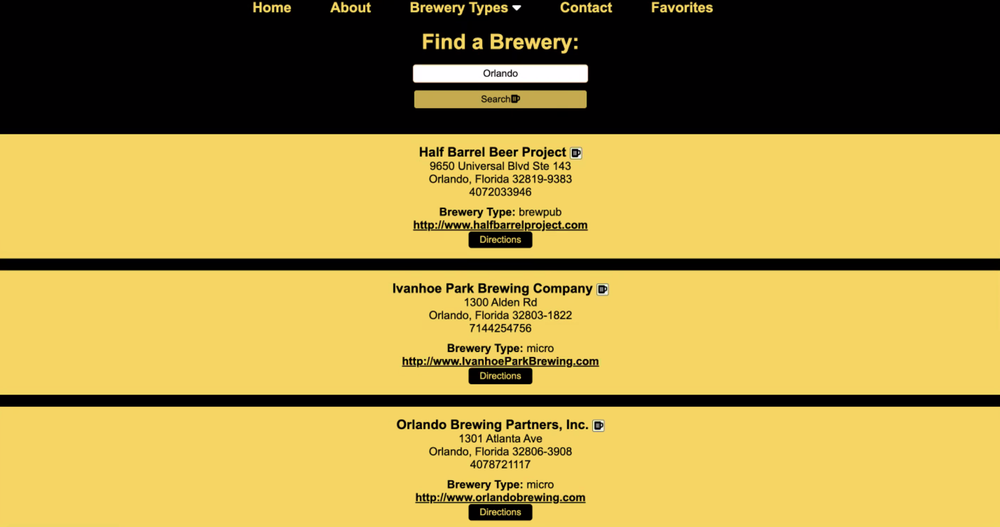
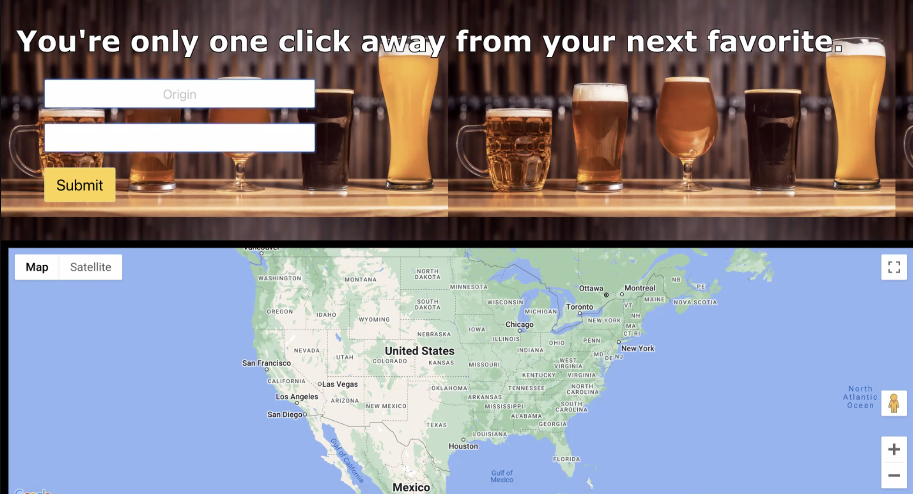

# BOYB: Brews On Your Block

## Description
This webpage helps you locate your next favorite brewery! Search any city in the United States and map out your route to get there.
- Breweries are popping up everyday but how can you keep track of all of them?
- Our group worked with Google Maps API and the Open Brewery DB API to help you with your future weekend plans.
- We learned how to get both APIs to work together and provide location based results.

## Usage
From the Home Page you can search for local breweries by any city name in the United States, like and keep track of your favorite ones and contact us with any further questions.

## Links to Live Page
 https://mmllively.github.io/Brews_and_Cruise/

## Credits
The Four-Loopin' Ladies UCF Coding Bootcamp Group: Karina Drummond (kdrummond528), Iia Wolak (wolaki96) & Maggie Lively (mmllively).

Instructional Support: Sam Codes tutorial: https://www.youtube.com/watch?v=BkGtNBrOhKU&t=970s

## Features
Features the Google Maps API and the Open Brewery DB API